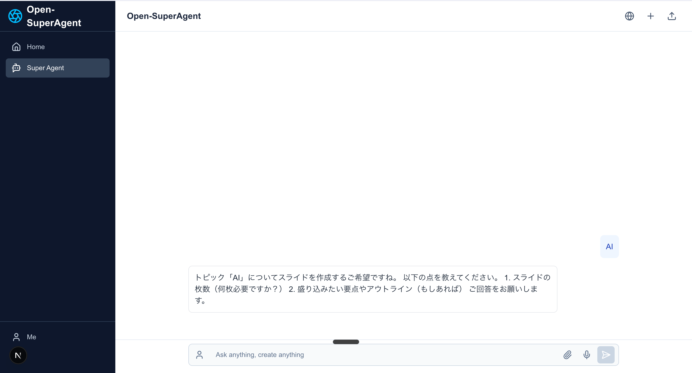

# Open-SuperAgent

AIアシスタント機能を備えたオープンソースチャットアプリケーション。Mastraエージェントと連携して、様々なタスクを自動化します。



## 🚀 すぐに試してみる（無料）

**最初は無料のAPIキーだけで、AIチャットと検索機能を体験できます！**

### 必要な無料APIキー（2つだけ）

1. **Google Gemini API（無料）**
   - [Google AI Studio](https://aistudio.google.com/app/apikey) にアクセス
   - Googleアカウントでサインイン
   - "Create API Key" をクリック
   - **無料枠**: 1分間あたり最大15リクエスト、1日1,500リクエストまで無料

2. **Brave Search API（無料）**
   - [Brave Search API](https://api.search.brave.com/app/keys) にアクセス
   - アカウント作成（GitHubアカウントでも可）
   - "Create new key" をクリック
   - **無料枠**: 月間2,000クエリまで無料

### クイックスタート

上記の2つのAPIキーを取得したら、詳細なセットアップ手順は下記の「セットアップ手順」セクションをご確認ください。

https://github.com/user-attachments/assets/a3d8a8e1-8d34-4a8b-8a3c-9e2a9b3e6d0f

ブラウザで http://localhost:3000 を開いて、AIチャットと検索を試してみましょう！

### 無料で使える機能

- ✅ **AIチャット**: Google Gemini 2.5 Flashによる高速な応答
- ✅ **Web検索**: Brave Searchを使った最新情報の検索
- ✅ **タスクプランニング**: 複数のタスクを効率的に実行
- ✅ **並列処理**: 独立したタスクを同時実行で高速化

他の機能（画像生成、音声生成、ブラウザ自動化など）を使いたい場合は、該当するAPIキーを追加で設定してください。

## 🐳 Docker で実行する

Dockerを使用すると、環境構築を簡単に行い、一貫した環境でアプリケーションを実行できます。

### OpenSuperAgent コンテナ概要

以下の3つのファイルで構成されたシンプルなDocker環境です：

1. `Dockerfile`: Dockerイメージの設計図です。ソースコードの取得、依存関係のインストールなどを行います。
2. `compose.yaml`: Dockerコンテナの起動設定を記述します。ビルド時の引数やポートフォワード、起動コマンドなどを指定します。
3. `.env`: `compose.yaml` で使用する環境変数を定義するファイルです。リポジトリのURLやブランチ名などを一元管理します。

これらのファイルだけを同じディレクトリに配置して使用します。

### 実行方法

1. 上記3つのファイル（`Dockerfile`, `compose.yaml`, `.env`）を同じディレクトリに作成します。
2. `.env` ファイル内の各種API-KEYなどを自身の情報に書き換えます。
3. `.env` ファイル内の `GIT_REPO_URL` や `BRANCH_NAME` などを、必要に応じて編集します。※編集しない場合はOpenSuperAgentの最新版が起動します。
4. ターミナルでそのディレクトリに移動し、以下のコマンドを実行します。

```bash
# Dockerイメージをビルドし、コンテナをバックグラウンドで起動
# (Docker Compose V2 の場合)
docker compose up --build -d

# (古いバージョンの場合)
# docker-compose up --build -d
```

これで、OpenSuperAgentのソースが自動でクローン（取得）され、依存関係がインストールされたコンテナが起動します。
ホストマシンの `3000` 番ポート（`.env` で指定）にアクセスすると、コンテナ内のOpenSuperAgentに接続できます。

**アクセス**: http://localhost:3000/

### その他のコマンド

```bash
# コンテナの停止と削除
docker-compose down

# ログの確認
docker-compose logs -f
```

## 主な機能

- **AIチャット**: シンプルで使いやすいチャットインターフェース
- **ツール実行**: Mastraエージェントを活用した各種タスクの自動化
- **ツール実行の可視化**: Mastraエージェントのツール実行状況をリアルタイムに表示
- **レスポンシブデザイン**: モバイルからデスクトップまで対応したUI

## 技術スタック

- **フロントエンド**: Next.js 15、TailwindCSS、Vercel AI SDK
- **バックエンド**: Mastraエージェントフレームワーク
- **音声生成**: MiniMax T2A Large v2 API
- **デプロイ**: Vercel

### 環境変数設定

```bash
# MiniMax T2A Large v2 API Configuration
MINIMAX_API_KEY=your_minimax_api_key_here
MINIMAX_GROUP_ID=your_minimax_group_id_here

# Browserbase Configuration (for browser automation)
# Get your API key from: https://browserbase.com/dashboard/settings
BROWSERBASE_API_KEY=your_browserbase_api_key_here
BROWSERBASE_PROJECT_ID=your_browserbase_project_id_here

# Google Generative AI Configuration (for Stagehand)
# Get your API key from: https://aistudio.google.com/app/apikey
GOOGLE_GENERATIVE_AI_API_KEY=your_google_ai_api_key_here
GEMINI_API_KEY=your_google_ai_api_key_here

# Anthropic Claude API Configuration
# Get your API key from: https://console.anthropic.com/settings/keys
ANTHROPIC_API_KEY=your_anthropic_api_key_here

# OpenAI API Configuration
# Get your API key from: https://platform.openai.com/api-keys
OPENAI_API_KEY=your_openai_api_key_here

# X.AI Grok API Configuration
# Get your API key from: https://x.ai/api
XAI_API_KEY=your_xai_api_key_here

# Brave Search API Configuration
# Get your API key from: https://api.search.brave.com/app/keys
BRAVE_API_KEY=your_brave_api_key_here

# V0 Code Generation API Configuration
# Get your API key from: https://v0.dev/settings
V0_API_KEY=your_v0_api_key_here

# Fal.ai API Configuration (for media generation)
# Get your API key from: https://fal.ai/dashboard/keys
FAL_KEY=your_fal_key_here

# Document Processing (Nutrient API)
# Get your API key from: https://nutrient.io/
NUTRIENT_API_KEY=your_nutrient_api_key_here

# Node Environment
NODE_ENV=development
```

## セットアップ手順

### 前提条件

- Node.js v20以上
- Mastraのローカル環境

### インストール

```bash
# リポジトリをクローン
git clone https://github.com/yourusername/open-superagent.git
cd open-superagent

# 依存パッケージをインストール
npm install

# 環境変数ファイルを作成
cp .env.example .env  # .env.exampleがない場合は手動で.envファイルを作成

# .envファイルを編集し、必要なAPIキーを設定
# 詳細は「環境変数設定」セクションを参照

# 開発サーバーを起動
npm run dev
```

### Mastraサーバーのセットアップ

1. Mastraサーバーを別のターミナルで起動:

```bash
cd open-superagent
mastra dev
```

2. Mastraエージェントのビルド:

```bash
mastra build
```

3. ブラウザで http://localhost:3000 にアクセス

## 使い方

1. チャットインターフェースでタスクや質問を入力
2. AIがタスクを理解し、適切なツールを実行
3. 結果がチャット内で表示される

## ライセンス

このプロジェクトは**二層ライセンス構造**を採用しています：

### 1. Open-SuperAgent独自コード
- **ライセンス**: MIT License with Commercial Use Restrictions
- **商用利用**: AI Freak SummitまたはAIで遊ぼうコミュニティのメンバーのみ可能
- **個人利用**: 誰でも可能（非商用・教育目的）

### 2. Mastraフレームワーク部分
- **ライセンス**: Apache 2.0 License
- **条件**:
  - ✅ **商用利用**: 制限なく可能
  - ✅ **ソースコードの変更**: 可能
  - ✅ **配布**: オリジナル版・改変版ともに可能
  - ⚠️ **ライセンス表示**: Apache 2.0ライセンステキストの保持が必要

### 使用可能なケース ✅
- 個人のローカル環境での使用
- 社内ツールとしての導入（コミュニティメンバーの場合）
- ソースコードの配布・共有
- 自社製品への組み込み（コミュニティメンバーの場合）
- **Mastraを使用したWebサービスの提供**（Apache 2.0により制限なし）
- **Mastraの商用利用**（Apache 2.0により制限なし）

### 禁止されているケース ❌
- Open-SuperAgent独自コード部分のコミュニティ非メンバーによる商用利用
- Apache 2.0ライセンステキストを削除しての再配布（Mastra部分）

詳細は[LICENSE](./LICENSE)および[NOTICE](./NOTICE)ファイルをご確認ください。

## 貢献について

バグレポートや機能リクエストは GitHub Issues で受け付けています。プルリクエストも大歓迎です！

### 貢献者

- [@jp_sayler](https://x.com/jp_sayler) - プロジェクトへの貢献

## 連絡先

質問や問い合わせは GitHub Issues または以下のSNSでお願いします:

- X (Twitter): [@taiyo_ai_gakuse](https://x.com/taiyo_ai_gakuse)

